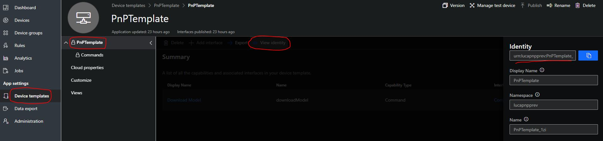

# Microsoft Azure IoTCentral SDK for Node.js (PnP Preview)

[](https://gitter.im/iotdisc/community?utm_source=badge&utm_medium=badge&utm_campaign=pr-badge&utm_content=badge)
[](https://github.com/lucadruda/iotc-nodejs-device-client/blob/master/LICENSE)


## Prerequisites
+ Node.js version 8.x or higher - https://nodejs.org

## Installing `azure-iotcentral-device-client` and types

```
npm install azure-iotcentral-device-client@pnp-preview
```

## Samples

A couple of samples in Javascripts can be found [here](https://github.com/lucadruda/iotc-samples)

When connecting a device to an IoT Central application an IIoTCClient is initialized.
SDK supports X509 and SymmetricKey authentication;

## Import

```
const IoTCClient = require('azure-iotcentral-device-client').IoTCClient;
```

## Initialization

Create method instantiate an IIoTCClient. All available methods can be called using callbacks or promises.
Supported authentications are x509 and SAS keys.

#### X509
```
const scopeId = '<SCOPE_ID>';
const deviceId = '<DEVICE_ID>';
const modelId='<CAPABILITY_MODEL_ID>';
const connectionType=IOTC_CONNECT.X509_CERT;
const passphrase = ''; //optional
const cert = {
    cert: "public cert"
    key: "private key",
    passphrase: "passphrase"
}


const iotc = IoTCClient.create(deviceId,scopeId,modelId,connectionType,cert);

```
- *scopeId*: The application DPS scope Id
- *deviceId*: The unique name for the device
- *modelId*: Id of capability model to assign device to. 'null' if not auto-provisioned.
- *cert*: Certificate object
- *connectionType*: Type of authentication. For certificate value is 'X509_CERT'.


#### SAS
```

const scopeId = '<SCOPE_ID>';
const deviceId = '<DEVICE_ID>';
const sasKey = '<SYMM_KEY>';
const modelId='<CAPABILITY_MODEL_ID>';
const connectionType=IOTC_CONNECT.SYMM_KEY;

const iotc = IoTCClient.create(deviceId,scopeId,modelId,connectionType,sasKey);

```
- *scopeId*: The application DPS scope Id
- *deviceId*: The unique name for the device
- *modelId*: Id of capability model to assign device to.
- *sasKey*: The symmetric key (individual or group)
- *connectionType*: Type of authentication. For symmetric keys use 'SYMM_KEY' for group enrollment with master key or 'DEVICE_KEY' for connection with device key.

## Listen to events

Before starting a connection, you should register event listeners to receive properties and commands.

### Listen to properties update
```
iotc.on('PropertiesUpdate', callback);
```
To provide properties sync aknowledgement, just call the _report()_ method.
```
const propertyCallback = (prop) => {
    console.log(`Received new value '${prop.value}' for property '${prop.name}' in interface '${prop.interfaceName}'`);

    // eventually acknowledge property
    prop.report(OperationStatus.SUCCESS);
}

iotc.on('PropertiesUpdated',propertyCallback);
```

### Listen to commands
```
iotc.on('Command',callback);
```
To provide acknoledgments for command execution result or progress, call _acknowledge()_ or _update()_ respectively. 
```
const commandCallback = async (cmd) => {
    console.log(`Received command '${cmd.name}' with parameter ${cmd.value} from interface '${cmd.interfaceName}'`);

    // e.g. sync command
    
    if (cmd.name === 'stop') {
        console.log('Received stop signal. Exiting...');
        await cmd.acknowledge(OperationStatus.SUCCESS);
        if (stopId) {
            clearInterval(stopId);
        }
        process.exit(0);
    }

    // e.g. async command
    
    else if(cmd.name === 'changeSpeed'){
        console.log('Changing speed);
        await cmd.acknowledge(OperationStatus.SUCCESS);
        // do work
        await cmd.update(OperationStatus.SUCCESS,'Speed successfully changed');
    }
}
```
### Register interfaces

Before connecting the device, required interfaces must be declared.

Each single interface can be declared with a single object when calling _addInterface()_.

```
e.g.

iotc.addInterface({
    name: '<INTERFACE_NAME>',
    id: '<INTERFACE_ID>',
    telemetry: ['temperature', 'pressure', 'humidity'],
    commands: ['stop'],
    properties: ['fanSpeed']
});
```

Interfaces can also be imported from a JSON capability model definition.

```
iotc.setCapabilityModel({<'CAPABILITY_MODEL_JSON'>});
```

### Connect

```
iotc.connect([callback])
```

After successfull connection, IOTC context is available for further commands.

Device can listen to connection status changes by registering for the 'ConnectionStatus' event:

```
iotc.on(IOTC_EVENTS.ConnectionStatus, () => {
    if (client.isConnected()) {
        console.log('Device is connected!! Starting telemetry...');
    }
});
```

All the callbacks are optional parameters and are triggered when message has reached the ingestion engine.

### Send telemetry

Send telemetry for an interface. Multiple telemetries can be sent for the same interface.

```
let obj = {
            temperature: Math.floor(Math.random() * 100),
            humidity: Math.floor(Math.random() * 100),
            pressure: Math.floor(Math.random() * 100)
        };
        console.log(`Sending ${JSON.stringify(obj)}`);
        client.sendTelemetry(obj, 'sensors');
```

### Send property update
```
iotc.sendProperty({fieldName:'fieldValue'}, '<INTERFACE_NAME>');
```


## One-touch device provisioning and approval
A device can send custom data during provision process: if a device is aware of its IoT Central model Id, then it can be automatically provisioned.

### How to set IoTC template ID in your device
Template Id can be found in the device template page of IoTCentral after selecting "View Identity" on the corresponding Capability Model.



### Automatic approval (default)
By default device auto-approval in IoT Central is enabled, which means a device can be provisioned without any manual action and can start sending/receiving data after status changes to "Provisioned"

### Manual approval
To change default behavior, administrator can disable device auto-approval from Device Connection page under the Administration section.


When disabled, administrator needs to approve the device registration to complete the provisioning process.
This can be done from explorer page after selecting the device


## Generate x509 certificates
IoT Central SDK comes with a tool to generate self-signed x509 certificates to be used when testing device connection.
If you want to generate certificates for 6 devices and also validate the authority you can run something like this:
```
const IoTCentral = require('azure-iotcentral');
const readline = require('readline');

const certificateGenerator = new IoTCentral.CertificateGenerator(6);
certificateGenerator.init()
    .then(() => {
        console.log('Generating root certificate');
        certificateGenerator.generateRoot.bind(certificateGenerator)()
            .then(() => {
                console.log('Generating device certificates');
                certificateGenerator.createDevices.bind(certificateGenerator)()
                    .then(() => {
                        const rl = readline.createInterface({
                            input: process.stdin,
                            output: process.stdout
                        });
                        rl.question('Insert validation code: ', async (answer) => {
                            const validationCert = await certificateGenerator.validate.bind(certificateGenerator)(answer);
                            console.log(`Validation certificate create at '${validationCert}'`);
                            rl.close()
                        });
                    })
            })
    });
```
This example wait for a validation code which is provided by IoTCentral in the device configuration page when uploading primary or secondary root certificate.
Resulting device certificates can be used in connection example above.