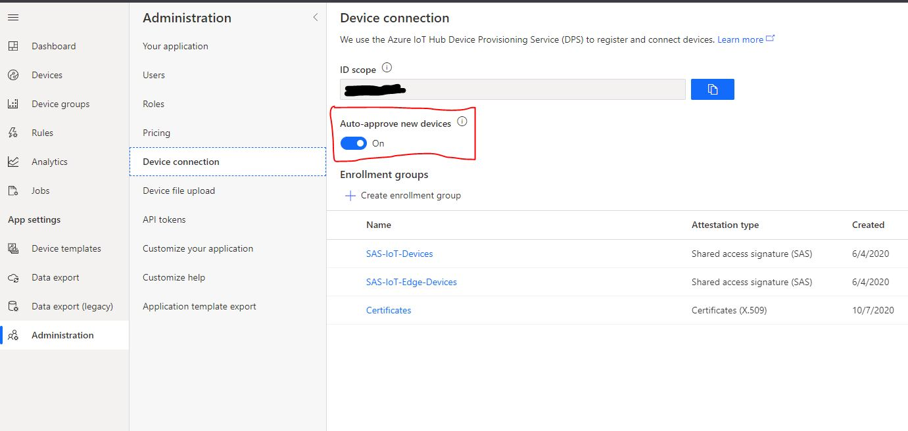

# Microsoft Azure IoTCentral SDK for Node.js

[](https://gitter.im/iotdisc/community?utm_source=badge&utm_medium=badge&utm_campaign=pr-badge&utm_content=badge)
[](https://github.com/lucadruda/iotc-nodejs-device-client/blob/master/LICENSE)


## Prerequisites
+ Node.js version 8.x or higher - https://nodejs.org

## Installing `azure-iotcentral-device-client` and types

```
npm install azure-iotcentral-device-client
```

## Types

Source code is written in Typescript so types are bundled with the package, you don't need to install any additional package.


## Samples

A couple of samples in Javascripts can be found [here](https://github.com/lucadruda/iotc-samples)


## Instructions

When connecting a device to an IoT Central application an IoTCClient is initialized.
SDK supports X509 and SymmetricKey authentication;

#### X509
```js
const iotCentral = require('azure-iotcentral-device-client');

const scopeId = '';
const deviceId = '';
const passphrase = ''; //optional
const cert = {
    cert: "public cert"
    key: "private key",
    passphrase: "passphrase"
}

const iotc = new iotCentral.IoTCClient(deviceId, scopeId, 'X509_CERT', cert);
```

#### SAS
```js
const iotCentral = require('azure-iotcentral-device-client');

const scopeId = 'scopeID';
const deviceId = 'deviceID';
const sasKey = 'masterKey';

const iotc = new iotCentral.IoTCClient(deviceId, scopeId, 'symm_key', sasKey);
```

### Connect
```ts
await iotc.connect([timeout]);
```
After successfull connection, IOTC context is available for further commands.

_connect_ accepts an optional timeout in seconds for connection operation.

<br/>

### Send telemetry

Send telemetry every 3 seconds
```js
setInterval(async () => {
            await iotc.sendTelemetry({
                field1: value1,
                field2: value2,
                field3: value3
            }, [properties]);
})
```
An optional *properties* object can be included in the send methods, to specify additional properties for the message (e.g. timestamp, content-type etc... ).
Properties can be custom or part of the reserved ones (see list [here](https://github.com/Azure/azure-iot-sdk-csharp/blob/master/iothub/device/src/MessageSystemPropertyNames.cs#L36)).


### Send property update
```js
await iotc.sendProperty({fieldName:'fieldValue'},[properties]);
```
An optional *properties* object can be included in the send methods, to specify additional properties for the message (e.g. timestamp, content-type etc... ).


### Listen to properties update
```js
iotc.on('Properties', callback);
```
e.g.
```js
const onPropertyChange = async (prop)=>{
    console.log(`New value ${prop.value} for property ${prop.name}`);
    await prop.ack(); // sync property value with the cloud
}

iotc.on('Properties',onPropertyChange);
```

### Listen to commands and offline commands
```js
iotc.on('Commands', callback);
```
e.g.
```js
const onCommandReceived = async (cmd) => {
    console.log(`Received command '${cmd.name}'${cmd.requestPayload ? ` with payload ${cmd.requestPayload}` : '.'}`);
    // command has been successfully executed
    await cmd.reply(IIoTCCommandResponse.SUCCESS, 'Completed');
}

iotc.on('Commands', callback);

```

For offline command, callback will trigger both when device is connected and when a command is enqueued and device re-connect after disconnession.


## One-touch device provisioning and approval
A device can send custom data during provision process: if a device is aware of its IoT Central template Id, then it can be automatically provisioned.

### How to set IoTC template ID in your device
Device template id (a.k.a Model Id) is used when obtaining authorization codes for new devices and automatically assign them to the right template. By providing template id during credentials generation, user doesn't need to manually migrate or assign device from IoT Central site.

In order to get the unique identifier, open configuration page for required model under "Device templates" section.


Click on "View Identity" and in next screen copy model urn.


Then call this method before connect():

```js
iotc.setModelId('<modelId>');
```

### Automatic approval (default)
By default device auto-approval in IoT Central is enabled, which means that administrators don't need to approve device registration to complete the provisioning process when device is not already created.



### Manual approval
If auto-approval is disabled, administrators need to manually approve new devices.
This can be done from explorer page after selecting the device


## Generate x509 certificates
IoT Central SDK comes with an handy tool to generate self-signed x509 certificates to be used when testing device connection.

```bash
npm run generate-certificates
```

This example wait for a validation code which is provided by IoTCentral in the device configuration page when uploading primary or secondary root certificate.
Resulting device certificates can be used in connection example above.

Instructions on connecting devices using x.509 on IoT Central [here.](https://docs.microsoft.com/en-us/azure/iot-central/core/concepts-get-connected#connect-devices-using-x509-certificates)