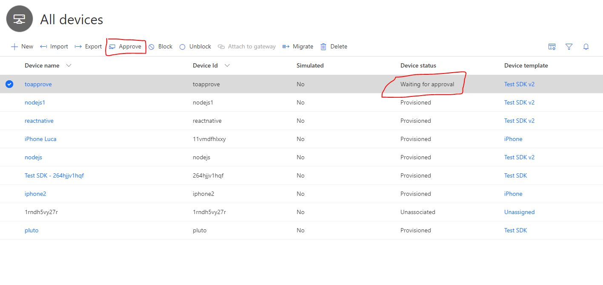

# Microsoft Azure IoTCentral SDK for Node.js (PnP Preview)

[](https://gitter.im/iotdisc/community?utm_source=badge&utm_medium=badge&utm_campaign=pr-badge&utm_content=badge)
[](https://github.com/lucadruda/iotc-nodejs-device-client/blob/master/LICENSE)


## Prerequisites
+ Node.js version 8.x or higher - https://nodejs.org

## Installing `azure-iotcentral-device-client` and types

```
npm install azure-iotcentral-device-client@pnp-preview
```

## Samples

A couple of samples in Javascripts can be found [here](https://github.com/lucadruda/iotc-samples)

When connecting a device to an IoT Central application an IoTCClient is initialized.
SDK supports X509 and SymmetricKey authentication;

#### X509
```
const iotCentral = require('azure-iotcentral-device-client');

const scopeId = '';
const deviceId = '';
const passphrase = ''; //optional
const cert = {
    cert: "public cert"
    key: "private key",
    passphrase: "passphrase"
}

const iotc = new iotCentral.IoTCClient(deviceId, scopeId, 'X509_CERT', cert);
```

#### SAS
```
const iotCentral = require('azure-iotcentral-device-client');

const scopeId = 'scopeID';
const deviceId = 'deviceID';
const sasKey = 'masterKey';

const iotc = new iotCentral.IoTCClient(deviceId, scopeId, 'symm_key', sasKey);
```

### Connect
Using callback
```
iotc.connect(callback)
```
Using promises
```
iotc.connect().then(()=>{
    console.log('Connected");
})
```
After successfull connection, IOTC context is available for further commands.

All the callbacks are optional parameters and are triggered when message has reached the ingestion engine.

### Send telemetry

Send telemetry every 3 seconds
```
setInterval(() => {
            iotc.sendTelemetry({
                field1: value1,
                field2: value2,
                field3: value3
            }, timestamp, sendCallback)
```
An optional timestamp field can be included in the send methods, to specify the UTC date and time of the message. This field must be in ISO format (e.g., YYYY-MM-DDTHH:mm:ss.sssZ). If timestamp is not provided, the current date and time will be used.

### Send state update
```
iotc.sendState({fieldName:'fieldValue'}, timestamp, sendCallback);
```
### Send event
```
iotc.sendEvent(event, timestamp, sendCallback);
```
### Send property update
```
iotc.sendProperty({fieldName:'fieldValue'}, sendCallback);
```
### Listen to settings update
```
iotc.on('SettingsUpdate', callback);
```
To provide setting sync aknowledgement, just call the _acknowledge()_ method.
```
iotc.on('SettingsUpdated',(settings: ISetting[]) => {
            settings.forEach(setting => {
                // do work
                setting.acknowledge('ack',[callback]);
                // or setting.acknoledge() with no message
            });
        });
```

### Listen to commands
```
iotc.on('Command',callback);
```
To provide feedbacks for a command execution result or progress, call _acknowledge()_ or _update()_ respectively. Remember to specify the command type to better handle progress.
```
iotc.on('Command', (cmd: ICommand) => {
            if (cmd.name == 'updFirmware') {
                cmd.type = CommandExecutionType.SYNC;
                cmd.acknowledge('Update completed',[callback]);
            }
            else
                if (cmd.name == 'downloadModel') {
                    cmd.type = CommandExecutionType.ASYNC;
                    cmd.update('Download in progress')
                    .then(()=>{
                        cmd.acknowledge('Command received')
                        .then(()=>{
                            setTimeout(async () => {
                            cmd.update('Download completed');
                            }, 5000);
                        });
                    });
                }
        });
```

## One-touch device provisioning and approval
A device can send custom data during provision process: if a device is aware of its IoT Central template Id, then it can be automatically provisioned.

### How to set IoTC template ID in your device
Template Id can be found in the device template page of IoTCentral after selecting "View Identity" on the corresponding Capability Model.


Then call this method before connect():

```
iotc.setModelId('<modelId>');
```

### Automatic approval (default)
By default device auto-approval in IoT Central is enabled, which means a device can be provisioned without any manual action and can start sending/receiving data after status changes to "Provisioned"

### Manual approval
To change default behavior, administrator can disable device auto-approval from Device Connection page under the Administration section.


When disabled, administrator needs to approve the device registration to complete the provisioning process.
This can be done from explorer page after selecting the device




## Generate x509 certificates
IoT Central SDK comes with a tool to generate self-signed x509 certificates to be used when testing device connection.
If you want to generate certificates for 6 devices and also validate the authority you can run something like this:
```
const IoTCentral = require('azure-iotcentral');
const readline = require('readline');

const certificateGenerator = new IoTCentral.CertificateGenerator(6);
certificateGenerator.init()
    .then(() => {
        console.log('Generating root certificate');
        certificateGenerator.generateRoot.bind(certificateGenerator)()
            .then(() => {
                console.log('Generating device certificates');
                certificateGenerator.createDevices.bind(certificateGenerator)()
                    .then(() => {
                        const rl = readline.createInterface({
                            input: process.stdin,
                            output: process.stdout
                        });
                        rl.question('Insert validation code: ', async (answer) => {
                            const validationCert = await certificateGenerator.validate.bind(certificateGenerator)(answer);
                            console.log(`Validation certificate create at '${validationCert}'`);
                            rl.close()
                        });
                    })
            })
    });
```
This example wait for a validation code which is provided by IoTCentral in the device configuration page when uploading primary or secondary root certificate.
Resulting device certificates can be used in connection example above.